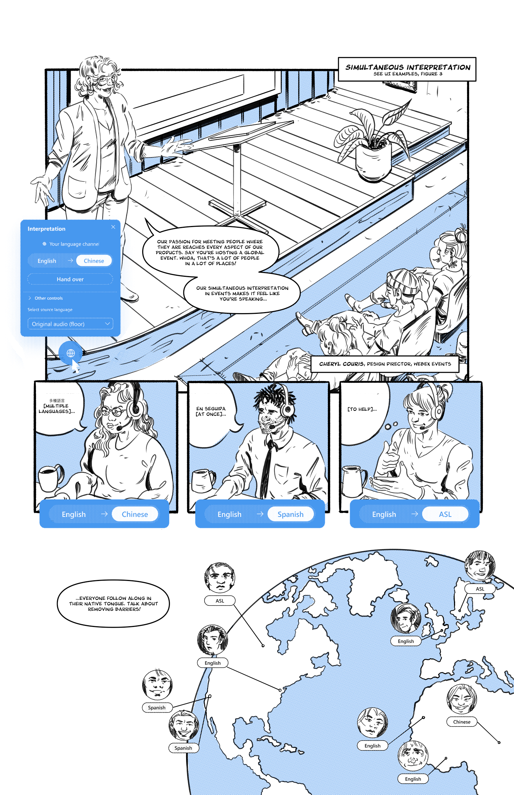
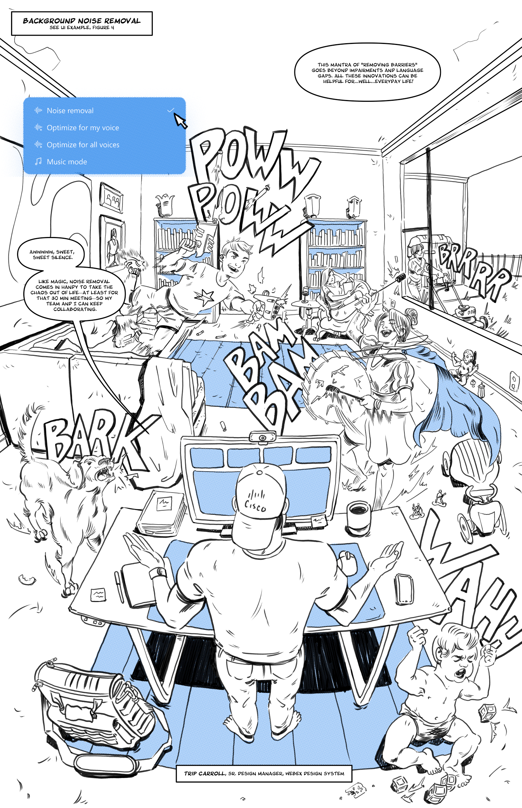
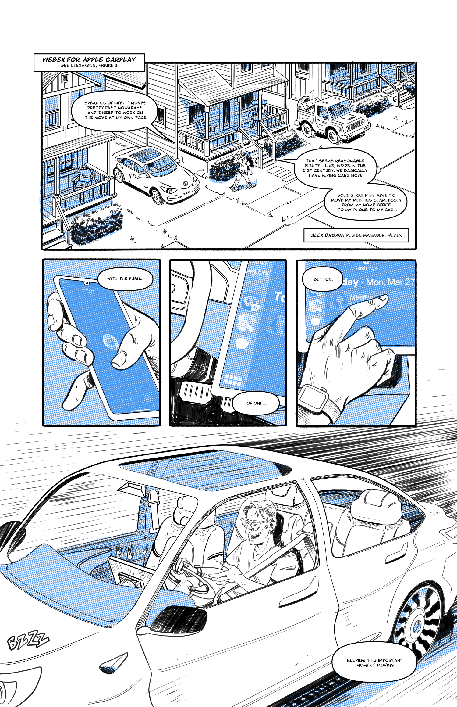

## A graphic novel that tells the story of how Webex is innovating in exciting ways to remove friction. Zap!

We zig where others zag. It’s standard practice to submit hero shots of your company’s freshest product features to design competitions. Makes sense. We want to put our best foot forward to showcase our talents in design innovation, after all. However, the story we sought to tell couldn’t easily be summarized in a single feature, or even a series of feature screens. Instead, we felt it was important to show and tell a more human story—how our innovations are impacting people’s work and lives in profound and positive ways.

Lucky for us, not only do we have talented UX/UI designers and engineers on our team, we also have amazingly talented artists and writers with broad interests and artistic sensibilities. We wrote and illustrated our entry in a delightful graphic novel-style narrative, because, why wouldn’t we?

Each “chapter” of the story addresses a Webex feature contextually, illustrating how it fits into people’s lives at the office, on stage, at home, on the go, or anywhere in between. Webex designers make cameos throughout to narrate the story, describing the human benefit in playful graphic vignettes. 

We’re delighted with the result (award or not), and can’t wait to continue the story. Find out more next time!